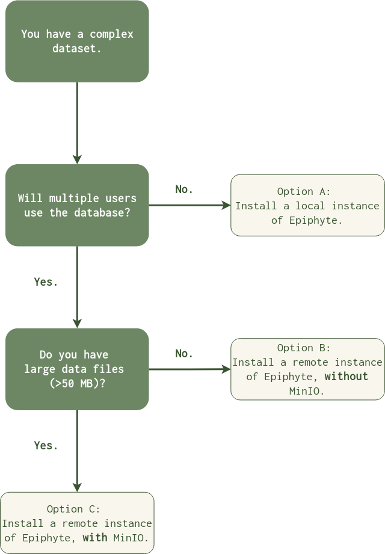

# Epiphyte

## What is Epiphyte?

Epiphyte is a worked data management solution that enables flexible analysis and parallel collaboration on complex datasets.
This solution is applied specifically to data consisting of high-dimensional neural signals and a naturalistic, continuous stimulus, although it could be adapted to any paradigm.

## Usage 

`Epiphyte` is a worked example, and contains a series of tutorial notebooks meant to bring users through the process of configuring, designing, and deploying a database environment that enables remote collaboration across multiple cities on a complex dataset. 

Going through the tutorials will yield a fully functional database, populated with generated mock neural activity and stimulus annotations. While users can in principle modify the import structure and table definitions, the goal of this project is:
1. to motivate a specific database structure for complex datasets, and
2. to provide a worked example for building and embedding such a database into an ecosystem that facilitates analysis and remote collaboration.

## How to install Epiphyte? 

Epiphyte can be configured and deployed for three main use cases, as found in the above flowchart. 

### Option A: Install a local instance of Epiphyte. 

Use cases: 
* You want to test out the database infrastructure before deploying to a remote server.
* You will be the only user and do not work with large data files. 

[Follow the installation instructions here:]()

[and continue to *Tutorial 4: Configure and connect to the database*.](docs/tutorials/set-up/3.%20Configure%20and%20connect%20to%20database.ipynb)

### Option B: Install a remote instance of Epiphyte, without MinIO.

Use cases:
* Multiple people, accessing from separate locations, will use the database. 
* You do not need to support large data files. 

[Complete *Tutorial 1: Launch the MySQL Database*](docs/tutorials/set-up/1.%20Launch%20the%20MySQL%20database.ipynb)

[and skip to *Tutorial 3: Install and set up Epiphyte*.](docs/tutorials/set-up/3.%20Install%20and%20set%20up%20Epiphyte.ipynb)

### Option C: Install a remote instance of Epiphyte, with MinIO.

Use cases:
* Multiple people, accessing from separate locations, will use the database. 
* You use large data files (e.g., LFP, movie data, multi-hour calcium imaging).

[Start at *Tutorial 1: Launch the MySQL database* and continue through the remaining tutorials.](docs/tutorials/set-up/1.%20Launch%20the%20MySQL%20database.ipynb)